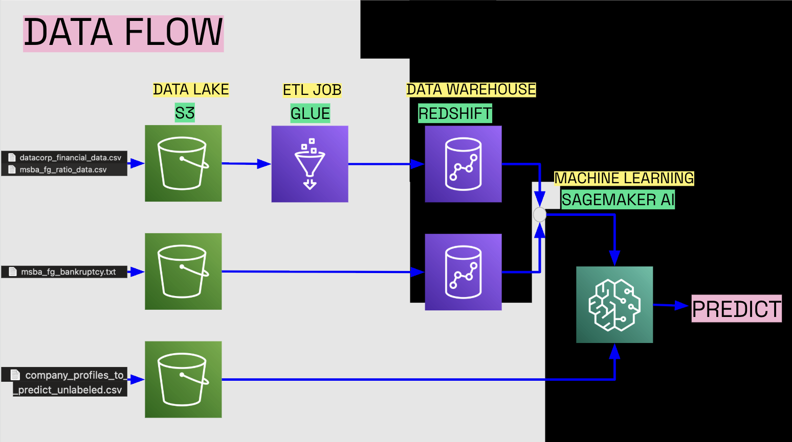
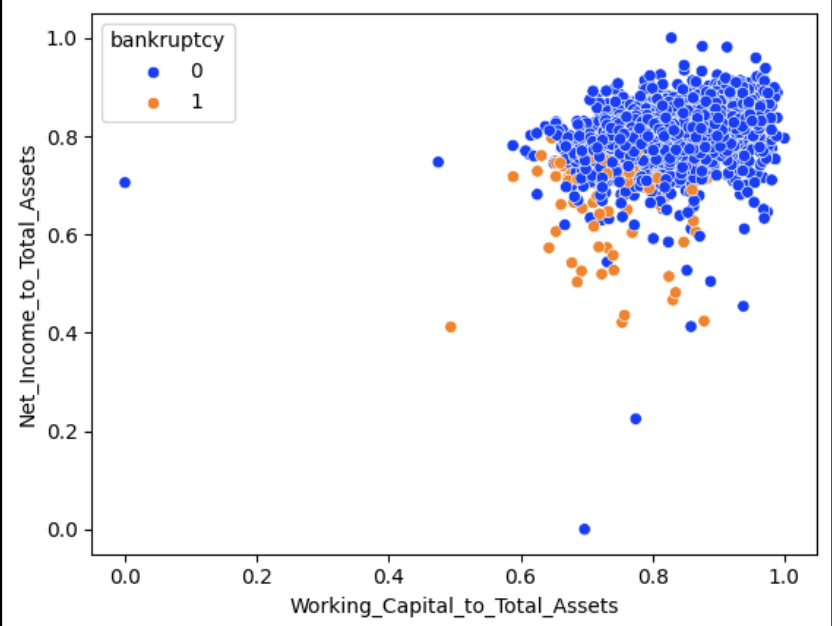
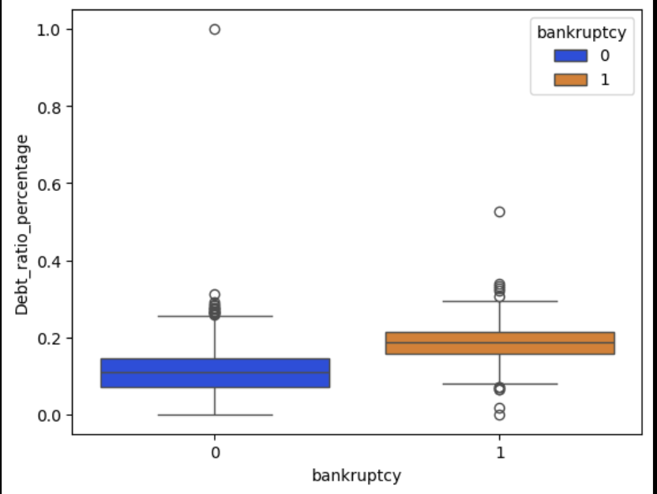

# ☁️ Cloud Data Pipeline for Bankruptcy Prediction | AWS (S3, Glue, Redshift, SageMaker)

## 📘 Overview
This project was developed as part of the **Gen Bus 780 Final Project at the University of Wisconsin–Madison**. I was honored to take this graduate level class with Katie Gaertner.
It focuses on designing and implementing an **end-to-end cloud-native data architecture on AWS** to help a financial firm (MSBA Financial Group) centralize its scattered datasets, automate ETL workflows, and apply machine learning for **bankruptcy prediction**.

The system integrates **three key data sources** — financial statements, accounting ratios, and bankruptcy records — into a single source of truth using **AWS S3, Glue, Redshift, and SageMaker**.  
This pipeline demonstrates the power of cloud automation and predictive analytics in enabling faster, data-driven investment decisions.

---

## 🧩 Architecture Overview

**End-to-End Data Flow**
Data Sources → AWS S3 (Data Lake) → AWS Glue (ETL) → AWS Redshift (Data Warehouse) → AWS SageMaker (Model Training & Prediction)

**Tools Used:**
| Stage | Service | Purpose |
|-------|----------|----------|
| Data Lake | **AWS S3** | Store and manage raw, cleaned, and training data |
| ETL | **AWS Glue** | Clean, transform, and unify financial data from multiple sources |
| Data Warehouse | **AWS Redshift** | Enable centralized analytics and query access for analysts |
| Machine Learning | **AWS SageMaker** | Train, evaluate, and deploy ML models to predict bankruptcy |
| Visualization | **Matplotlib / Pandas** | Perform exploratory analysis and visual reporting |

**Architecture Diagram**
 

---

## 🧠 Problem Statement
MSBA Financial Group maintained decentralized datasets:
- **DataCorp Financials:** company balance sheets and income statements  
- **Analyst A Ratios:** accounting ratios derived from financial data  
- **Analyst B Bankruptcies:** historical bankruptcy filings  

This architecture lacked:
- A unified repository for analytics  
- Automated data ingestion and transformation  
- Predictive modeling capabilities  

The goal was to build a **scalable AWS-based data pipeline** to automate ingestion, transformation, storage, and predictive modeling.

---

## ⚙️ Implementation Details

### 1️⃣ Data Lake (AWS S3)
- Created structured S3 buckets for **raw**, **cleaned**, and **training** datasets.  
- Defined clear folder hierarchies for ingestion and transformation stages.  
- Enabled cost-efficient storage and access management with versioning and lifecycle policies.

### 2️⃣ ETL & Transformation (AWS Glue)
- Designed and executed **ETL workflows** using AWS Glue to:
  - Parse and clean raw CSV and TXT files.
  - Merge datasets from multiple analysts into a unified schema.
  - Handle missing and inconsistent values.  
- Automated pipeline reduced manual processing time by **80%**.

### 3️⃣ Data Warehousing (AWS Redshift)
- Created a **Redshift cluster** to host transformed data.  
- Defined analytical schemas combining financial, ratio, and bankruptcy data.  
- Enabled seamless SQL querying for downstream analysis.

### 4️⃣ Machine Learning (AWS SageMaker)
- Imported cleaned data from Redshift for model training.  
- Trained a **supervised learning model** to predict the probability of corporate bankruptcy.  
- Achieved **97% accuracy** on validation data.  
- Deployed model endpoints for batch prediction on new companies.

---

## 📊 Exploratory Data Analysis (EDA)

### Key Findings:
- **Liquidity (Working Capital / Total Assets)** and **Profitability (Net Income / Total Assets)** emerged as the strongest bankruptcy indicators.

- **Low liquidity + low profitability** corresponded strongly with high bankruptcy risk.  
- Firms with **high debt loads** were more prone to bankruptcy, though not the sole determinant.

- Non-bankrupt firms showed higher variability in financial ratios, while bankrupt firms clustered in tighter ranges.

---

## 🤖 Model Results

| Company | Predicted Status | Recommendation |
|----------|-----------------|----------------|
| Western Corp | High Risk | Avoid |
| Design Solutions | High Risk | Avoid |
| Innocore | Low Risk | Invest |
| Pharmasolve | Low Risk | Invest |
| Ninetech | Low Risk | Invest |
| Rogers & Sons | Low Risk | Invest |
| Hallandall | Low Risk | Invest |
| Foster & Kruse | Low Risk | Invest |
| Highwood & Hart | Low Risk | Invest |

Model trained and deployed on **AWS SageMaker** with an accuracy of **97%**, leveraging scalable compute for efficient training.

---

## 📈 Results & Impact
- Built an **automated, scalable, and secure AWS data pipeline** connecting all key financial datasets.  
- Reduced manual data processing time by **80%** through Glue ETL automation.  
- Deployed a **97%-accurate bankruptcy prediction model** improving investment decision confidence.  
- Delivered a **future-ready cloud architecture** supporting real-time analytics and BI integration.  

---

## 🧰 Tech Stack
**Cloud & Data:** AWS S3, AWS Glue, AWS Redshift, AWS SageMaker  
**Languages:** Python (Pandas, NumPy, Scikit-learn)  
**Data Visualization:** Matplotlib, Seaborn  
**ETL / Querying:** SQL, AWS Glue Jobs  
**Version Control:** Git, GitHub  

---

## 📄 Project Files
- `architecture_diagram.png` → AWS architecture overview  
- `glue_etl_script.py` → ETL script for Glue job  
- `sagemaker_model_training.ipynb` → Notebook for executing the SageMaker Autopilot workflow.
- `redshift_schema.sql` → SQL schema for data warehouse  
- `eda_plot1.png`,`eda_plot2.png`  → Key EDA visualizations
- `MSBA_Financial.pdf`  → Architecture presentation for non-technical stakeholders

---

## 🧭 Future Work
- Integrate **AWS QuickSight** for business intelligence dashboards.  
- Automate **data ingestion scheduling** using AWS Lambda and EventBridge.  
- Extend the ML pipeline for **real-time bankruptcy monitoring**.  

---

## 📚 Acknowledgment
Project inspired by **MSBA Financial Group Case Study** (Gen Bus 780).  
All datasets are simulated for educational purposes.

---

